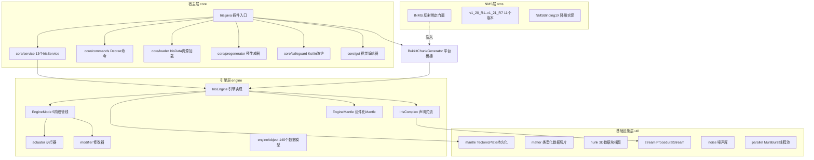
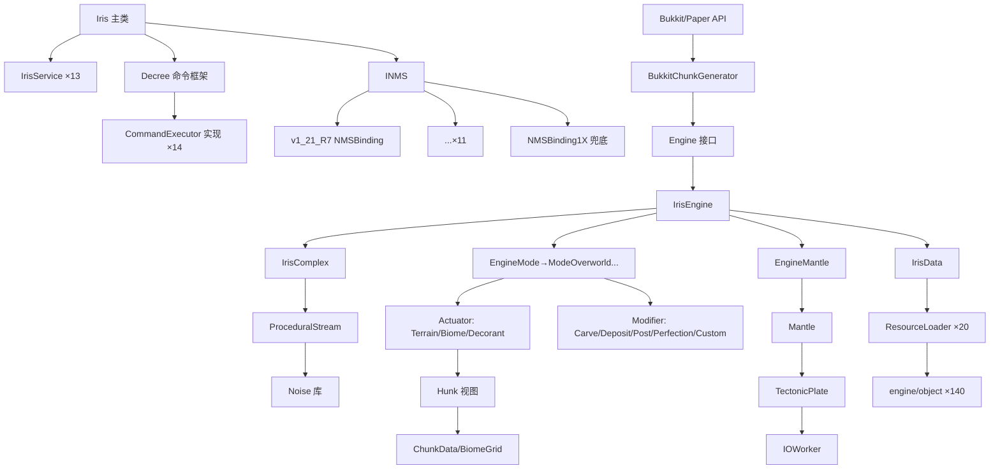

# Iris 项目架构报告

> 分析时间：2026-08-22 · 模式：采样分析 · 证据格式 `文件:行号`

## 1. 分层结构全景



## 2. 模块划分与依赖方向

| 模块 | 角色 | 关键内容 |
|------|------|---------|
| `:core` | 插件宿主/业务层 | 入口、服务、命令、配置、预生成、Studio 编辑器、GUI、脚本宿主 |
| `:core:agent` | Java Agent | `Installer.java`：运行时向自身 jar 注入（供 `runServer-*` 任务使用，`build.gradle.kts:115`） |
| `:nms:*`（11 个） | 版本适配层 | 每模块一个 `NMSBinding` 实现，compileOnly 依赖 core（`build.gradle.kts:84-94`） |
| `buildSrc` | 构建逻辑 | `ApiGenerator.kt`（构建期生成并发布 API jar）、`NMSBinding.kt`（NMSTools 插件封装） |

依赖方向严格单向：`core → (无外部)`，`nms:* → core (compileOnly)`，最终通过 `jarJar` 把全部 NMS 版本打进一个发布 jar（`build.gradle.kts:120-123`）。

## 3. 包结构功能标注（core/src/main/java/com/volmit/iris/）

| 包 | 层次 | 职责 |
|----|------|------|
| `.`（根） | 入口层 | `Iris.java` 主类（750 行） |
| `core/service` | 业务逻辑层 | 13 个服务：StudioSVC（包开发环境）、ConversionSVC（存档转换）、EditSVC、ExternalDataSVC（第三方方块数据）、GlobalCacheSVC、IrisEngineSVC、LogFilterSVC、ObjectSVC、PreservationSVC、TreeSVC、WandSVC、BoardSVC、CommandSVC |
| `core/commands` | 表现层 | 14 个命令类（CommandIris/Studio/Pregen/Jigsaw/What...），基于自研 Decree 框架 |
| `core/loader` | 数据访问层 | `IrisData`（592 行）门面 + 20 个 `ResourceLoader<T>`（biome/region/dimension/generator/jigsaw*/entity/loot/cave/ravine/expression/object/matter/image/script，`IrisData.java:62-82`） |
| `core/nms` | 外部接口层 | `INMS` 版本门面 + `INMSBinding` 接口（60+ 方法：生物群系注入、tile 序列化、实体生成、数据包安装、结构放置等） |
| `core/pregenerator` | 业务逻辑层 | 预生成世界：Turbo（先 region 文件后回写）、DeepSearch、Lazy 三种策略 |
| `core/gui` | 表现层 | NoiseExplorerGUI/VisionGUI——无依赖 Swing 可视化地图渲染 |
| `core/safeguard`（Kotlin） | 基础设施 | 反破解验证、启动横幅、Mode 枚举 |
| `core/scripting` | 业务逻辑层 | Kotlin 脚本引擎宿主：EngineEnvironment/PackEnvironment + func/BiomeLookup |
| `engine` | 核心引擎 | `IrisEngine`（583 行实现）+ `IrisComplex`（412 行流图） |
| `engine/framework` | 核心抽象 | `Engine` 接口（1006 行，含 updateChunk 区块生命周期逻辑）+ EngineMode/Stage/Actuator/Modifier/Decorator 组件契约 |
| `engine/actuator` | 管线步骤 | IrisTerrainNormalActuator（地形）、IrisBiomeActuator（群系）、IrisDecorantActuator（装饰） |
| `engine/modifier` | 管线步骤 | Carve（洞穴雕刻）、Deposit（矿床）、Post、Perfection、Custom |
| `engine/mode` | 管线编排 | ModeOverworld/Islands/Enclosure/SuperFlat——每种维度模式注册不同 Stage 链 |
| `engine/mantle` + `util/mantle` | 数据层 | EngineMantle 接口 + IrisMantleComponent + Mantle/TectonicPlate/MantleChunk 持久化 |
| `engine/object` | 数据模型 | 140 个 Iris* POJO（Gson 反序列化的数据包格式） |
| `engine/platform` | 平台桥接 | BukkitChunkGenerator（450 行，Bukkit ChunkGenerator 适配）+ Dummy* 降级实现 + studio/ |
| `util/*`（35 个包） | 基础设施 | hunk/matter/stream/noise/parallel/scheduling/decree（命令框架）/collection(KList/KMap)/io/nbt/... |

## 4. 架构模式判定

**① 组件化流水线（Pipeline + Strategy）** — 引擎核心
- `EngineMode`（策略接口）→ `EngineStage`（函数式阶段）→ `burst()` 组合并行（`EngineMode.java:45-56`）
- `ModeOverworld` 构造器中一次性声明全部 9 个子步骤并组装成 5 个 Stage（`ModeOverworld.java:34-67`），每维度模式（SuperFlat/Islands/Enclosure）是独立策略类。

**② 声明式流式计算（Lazy Stream DAG）** — `IrisComplex`
- 25+ 个 `ProceduralStream` 字段构成依赖图：`regionStream`（129-134 行）→ 四类群系流（cave/land/sea/shore，137-173 行）→ `bridgeStream`（海陆判定，174-179）→ `baseBiomeStream`（182-184）→ `heightStream`（185-188）→ `slopeStream`/`trueBiomeStream`（191-199）→ 7 条装饰流（205-218）。
- 每条流以 `.cache2D(name, engine, cacheSize)` 挂接 LRU 缓存，以 `.waste(name)` 注册调试观测点。

**③ 服务定位器 + 反射注册（Service Locator）** — 插件层
- `Iris.enable()` 用 `JarScanner` 扫描 `com.volmit.iris.core.service` 包反射实例化全部服务（`Iris.java:440`），`Iris.service(Class)` 静态查找（`Iris.java:117-119`）。

**④ 适配器 + 动态绑定（Adapter + Reflective Binding）** — NMS 层
- `INMS.bind()` 从 CraftBukkit 类名解析版本 tag，`Class.forName("com.volmit.iris.core.nms."+code+".NMSBinding")` 实例化，失败降级 `NMSBinding1X`（`INMS.java:80-103`）。

**⑤ 观察者（Event Bus）** — 与 Bukkit 事件系统双向集成
- 自定义事件（IrisEngineHotloadEvent、IrisLootEvent 等，`core/events`）经 `Iris.callEvent()` 保证主线程派发（`Iris.java:121-127`）。

**⑥ 仓库模式（Repository）** — 数据包加载
- `ResourceLoader<T>` 按 "目录名/文件名.json" 寻址缓存；`IrisData.loadAny*` 系列在多数据源（pack 目录）间就近查找（`IrisData.java:124-152`）。

**显著设计模式痕迹**：Builder（IrisWorld.builder，`Iris.java:650`）、单例（Iris.instance，`Iris.java:88`）、门面（IrisData 对 20 个 loader）、模板方法（IrisEngineMode.close→dump）、函数式组合（EngineStage 为六参数函数接口）。

## 5. 函数级调用链（核心路径）

### 5.1 插件启动链

```
Iris() 构造器                                     Iris.java:431-434
  ├── instance = this（单例）
  └── SlimJar.load()（动态依赖装载）
onEnable()                                        Iris.java:550-554
  └── enable()                                    Iris.java:436-467
      ├── setupAudience() → Adventure 消息         Iris.java:535-544
      ├── Bindings.setupSentry()（错误上报）
      ├── JarScanner("com.volmit.iris.core.service").forEach → services.put   Iris.java:440
      ├── IrisCompat.configured(compat.json)       Iris.java:442
      ├── ServerConfigurator.configure()
      ├── IrisSafeguard.execute() / splash()       Iris.java:444-446
      ├── new ChunkTickets / MultiverseCoreLink / FileWatcher(settings.json)  Iris.java:447-449
      ├── services.onEnable + registerListener     Iris.java:450-451
      ├── addShutdownHook()（关闭全部引擎+线程池）   Iris.java:469-485
      └── J.s(异步批次):
          ├── LazyPregenerator.loadLazyGenerators  Iris.java:455
          ├── bstats()                             Iris.java:456
          ├── J.ar(checkConfigHotload, 60s)        Iris.java:457（settings.json 热重载）
          ├── J.sr(tickQueue, 0)                   Iris.java:458（主线程队列，25ms/帧预算，Iris.java:597-614）
          ├── setupPapi()                          Iris.java:459
          ├── autoStartStudio()                    Iris.java:462
          └── checkForBukkitWorlds()               Iris.java:463（按 bukkit.yml 重建 Iris 世界）
```

### 5.2 世界接入链（跨层）

```
Bukkit 请求生成器 getDefaultWorldGenerator(world, id)        Iris.java:639-672
  ├── loadDimension(worldName, id)                           Iris.java:675-690
  │   ├── 世界目录 iris/pack 下 IrisData.getDimensionLoader().load
  │   ├── 失败 → IrisData.loadAnyDimension（全局 pack 搜索）
  │   └── 仍失败 → StudioSVC.downloadSearch（在线下载包）      Iris.java:681
  ├── IrisWorld.builder().seed(1337→真实种子稍后注入).build     Iris.java:650-657
  ├── pack 缺失 → StudioSVC.installIntoWorld（拷贝默认包）     Iris.java:666-669
  └── return new BukkitChunkGenerator(w, false, ff, key)      Iris.java:671

WorldInitEvent（世界创建时）                                   BukkitChunkGenerator.java:109-122
  └── initialize(world)
      ├── INMS.get().inject(seed, engine, world)（注入自定义 BiomeSource）BukkitChunkGenerator.java:128
      └── IrisWorlds 注册维度 key                             BukkitChunkGenerator.java:137
```

### 5.3 区块生成链（引擎最深路径，串行 Stage + Stage 内并行）

```
BukkitChunkGenerator.generateNoise(world, rnd, x, z, d)       BukkitChunkGenerator.java:356-385
  ├── TerrainChunk.create(d, IrisBiomeStorage)（包装 ChunkData）
  ├── ChunkDataHunkHolder / BiomeGridHunkHolder（Hunk 视图）
  └── engine.generate(x<<4, z<<4, blocks, biomes, multicore)
      └── EngineMode.generate(x, z, blocks, biomes, mc)       EngineMode.java:71-78
          ├── new ChunkContext(x, z, complex)（预采样缓存 region/biome/height 二维数组）
          ├── IrisContext.getOr(engine).setChunkContext(ctx)（线程上下文注入）
          └── for (EngineStage i : getStages()) i.generate(...)
              ModeOverworld 5 Stage：                        ModeOverworld.java:53-67
              S1 burst[ generateMatter → EngineMantle.generateMatter
                       | terrain   → IrisTerrainNormalActuator.onActuate    :53-61
                                     └── terrainSliver ×16（每 x 列从天到基岩）:76-161
                                          ├── biome.generateOres（三级优先：群系>区域>维度）:109-111
                                          ├── 海平面以上：biome.generateSeaLayers + fluid :117-131
                                          └── 地表以下：biome.generateLayers → ore → rock :133-157 ]
              S2 burst[ cave.modify（IrisCarveModifier 洞穴/峡谷雕刻）
                     | post.modify（IrisPostModifier 后处理） ]
              S3 burst[ deposit.modify（矿床）
                     | insertMatter → getMantle().insertMatter(BlockData 写入 Mantle） EngineMantle.java:178-189
                     | decorant.actuate（装饰物放置，读写 Mantle 支持跨区块）]
              S4 perfection.modify（IrisPerfectionModifier 边界完善）
              S5 custom.modify（IrisCustomModifier Kotlin 脚本钩子）
  └── blocks.apply(); biomes.apply()（Hunk 批量写回 ChunkData/BiomeGrid）
```

### 5.4 Stage 并行机制（函数签名）

```java
// EngineMode.java:45-56 —— burst 把多个 Stage 打包成一个并行 Stage
default EngineStage burst(EngineStage... stages) {
    return (x, z, blocks, biomes, multicore, ctx) -> {
        BurstExecutor e = burst().burst(stages.length);   // MultiBurst 线程池
        e.setMulticore(multicore);                         // 设置开关：settings.json useMulticore
        for (EngineStage i : stages)
            e.queue(() -> i.generate(x, z, blocks, biomes, multicore, ctx));
        e.complete();                                      // 屏障等待
    };
}
```

`MultiBurst`（`util/parallel/MultiBurst.java`）是全局 ForkJoinPool 风格线程池，`MultiBurst.burst` / `MultiBurst.ioBurst` 分别服务计算与 IO；关闭钩子统一 shutdown（`Iris.java:480-481`）。

## 6. 模块依赖图（Mermaid）



## 7. 技术栈与关键依赖

| 依赖 | 用途 | 证据 |
|------|------|------|
| Lombok | @Data/@Getter 消除样板 | `lombok.config`；`IrisEngine.java:71-73` |
| Gson | 数据包 JSON ↔ 140 个模型 | `IrisEngine.java:284` |
| Adventure (Kyori) | 富文本/颜色 | `Bindings.Adventure`，`Iris.java:537` |
| Sentry | 生产错误上报 | `Bindings.setupSentry()`，`Iris.java:439` |
| Kotlin Scripting | 数据包内嵌 .kts 脚本 | `core/scripting/kotlin/`、`IrisEngine.java:183` |
| ByteBuddy | NMS 运行时注入 | `nms/*/build.gradle` compileOnly |
| PaperLib | 异步区块 API | `BukkitChunkGenerator.java:44,145` |
| bStats | 匿名指标 | `Iris.java:616-620` |
| NMSTools (Volmit) | 构建期 NMS 反混淆映射 | `build.gradle.kts:28` |

## 8. 架构风险与技术债

1. **`Iris.java` 上帝类**：静态工具 + 单例 + 日志 + 缓存下载 + 事件 + 生成器接入共 750 行，所有模块反向依赖它。
2. **零测试**：`core/src` 下没有任何 `*test*` 文件（`find` 验证为 0），13 万行逻辑完全靠运行时验证。
3. **静默吞异常**：`Iris.initialize()` 等多处 `catch (Throwable ignored)`（`Iris.java:137,318`），排障困难。
4. **魔法降级**：生成失败时铺一层 `RED_GLAZED_TERRACOTTA` 作为可见错误标记（`BukkitChunkGenerator.java:379-383`）——优雅但 undocumented。
5. **TODO 残留**：`queueRegenerate` 返回 false 占位（`EngineMantle.java:205-211`）、`updateChunk` 中随机延迟注释 "Why is there a random delay here?"（`Engine.java:356`）。
