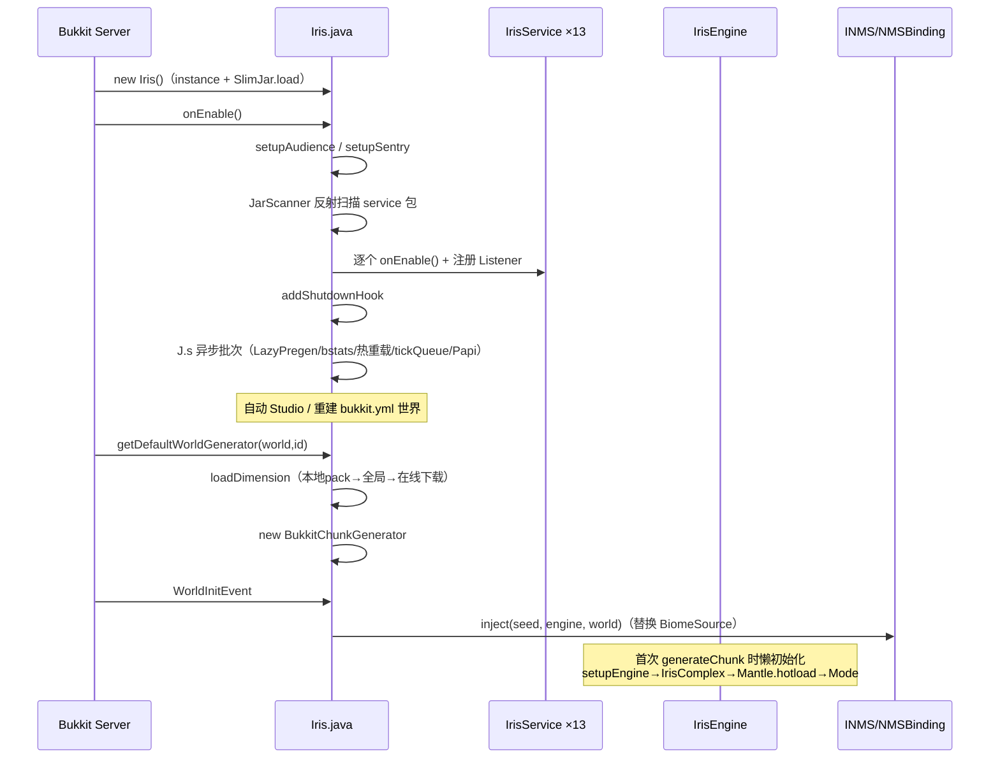
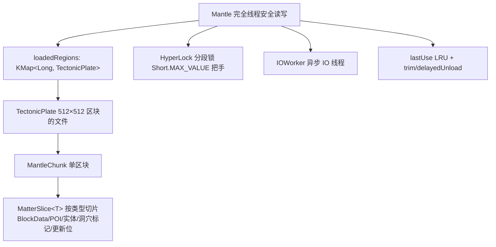
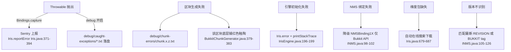

# Iris 运行原理报告

> 分析时间：2026-08-22 · 覆盖：启动流程 / 区块生成数据流（变量级）/ Mantle 状态管理 / 区块生命周期 / 错误处理链路

## 1. 启动流程时序



关键点：
- **种子两段式**：`getDefaultWorldGenerator` 先用占位种子 `1337`（`Iris.java:652`），`WorldInitEvent` 时用真实种子回填 `world.setRawWorldSeed`（`BukkitChunkGenerator.java:113`），引擎构造时还有 `verifySeed()` 用 engine-data.json 中持久化的种子矫正（`IrisEngine.java:145-149`）——保证同世界重启种子稳定。
- **引擎懒初始化**：`getEngine(world)` 双检锁，首次调用才 `setupEngine()`（`BukkitChunkGenerator.java:269-306`），Studio 模式额外启动 250ms 周期的 `Looper` 监视数据包目录变化（`BukkitChunkGenerator.java:285-299`）。
- **双引擎身份**：生产世界（studio=false）与 Studio 编辑世界（studio=true）共用 `IrisEngine`，差异仅在热重载行为与 `ReactiveFolder` 监视（构造器 `BukkitChunkGenerator.java:94-107` 的 `folder` 回调触发 `hotload()`）。

## 2. 核心数据流：区块生成（变量级）

### 2.1 数据流总图


### 2.2 变量级数据变换（terrainSliver，单条 x 列）

入口：`IrisTerrainNormalActuator.onActuate(x, z, h, multicore, ctx)`（`IrisTerrainNormalActuator.java:53-61`）→ 对 `xf∈[0,16)` 调 `terrainSliver`（76-161 行）。

| 步骤 | 变量 | 类型 | 值/状态变化 | 代码位置 |
|------|------|------|------------|---------|
| 1 | `biome` | `IrisBiome` | `ctx.getBiome().get(xf, zf)`——ChunkContext 预采样缓存，避免每方块重复走流图 | :84 |
| 2 | `he` | `int` | `min(h.getHeight(), ctx.height.get(xf,zf))`——地形表面高度（四舍五入） | :86 |
| 3 | `hf` | `int` | `max(fluidHeight, he)`——流体覆盖高度（海洋填水到海平面） | :87 |
| 4 | `blocks` | `KList<BlockData>` | 懒初始化：`biome.generateLayers(...)` 返回地表向下逐层调色板 | :136-141 |
| 5 | `fblocks` | `KList<BlockData>` | 懒初始化：`biome.generateSeaLayers(...)`——水下沉积层 | :121 |
| 6 | `ore` | `BlockData` | 三级优先采样：`biome.generateOres` → `region.generateOres` → `dimension.generateOres`，命中即替换该深度方块 | :109-111,149-151 |
| 7 | 写入 | — | `i>he && i<=hf`：水层/海底层；`i<=he`：调色板层，越界则矿石否则 `ctx.rock.get`（基岩层流） | :117-157 |
| 复杂度 | — | — | O(16×384) 每 chunk 列；调色板列表按需构建 O(layers)，矿石采样每方块 O(1)（RNG 决定） | — |

**边界条件**：`hf < 0` 跳过该列（世界底以下，:89-91）；`i == 0` 且 `dimension.isBedrock()` 强制基岩（:101-107）；`i >= h.getHeight()` 跳过（超高，:97-99）。

### 2.3 ChunkContext：跨 Stage 共享缓存（消除 80% 重复采样）

`EngineMode.generate` 每区块创建 `ChunkContext(x, z, complex)`（`EngineMode.java:72`），内部把 `regionStream/heightStream/trueBiomeStream/caveBiomeStream` 在 16×16 网格上的结果物化为数组。IrisComplex 各流的 `.contextInjecting(...)` 算子让流采样优先读 ChunkContext（如 `IrisComplex.java:137,189,200`）——同一区块内 Stage1~5 重复查询不再穿透到噪声层。

`IrisContext.getOr(engine).setChunkContext(ctx)`（`EngineMode.java:73`）以 ThreadLocal 方式把上下文绑定到当前生成线程，支持多区块并行时各自独立。

## 3. 声明式流图原理（IrisComplex）

```mermaid
graph TD
    RS[regionStyleStream 噪声] -->|selectRarity 按稀有度分配| REG[regionStream → IrisRegion]
    REG -->|每区域独立噪声+zoom| LAND[landBiomeStream] & SEA[seaBiomeStream] & SHORE[shoreBiomeStream] & CAVE[caveBiomeStream]
    CONT[continentalStyle 大陆噪声] -->|landChance 阈值| BR[bridgeStream → InferredType]
    BR -->|按类型路由到对应群系流| BASE[baseBiomeStream]
    BASE -->|implode 混合边界| HEIGHT[heightStream → double 海拔]
    HEIGHT -->|round| RH[roundedHeight] & |slope 3| SLOPE[slopeStream 坡度]
    HEIGHT -->|fixBiomeType 海岸线修正| TRUE[trueBiomeStream 最终群系]
    TRUE --> DECOR[7 条装饰流 surface/ceiling/cave/shore/seaSurface/seaFloor]
    HEIGHT -->|max fluidHeight| FLUID[heightFluidStream]
```

修正算法 `fixBiomeType(h, biome, region, x, z, fluidHeight)`（`IrisComplex.java:282-302`）——用海拔与海平面关系强制群系类别一致性：

| 条件 | 动作 |
|------|------|
| `fluidHeight-1 ≤ h ≤ fluidHeight+shoreHeight` 且非岸线群系 | 换用 `shoreBiomeStream` |
| `h > fluidHeight+shoreHeight` 且非陆地群系 | 换用 `landBiomeStream` |
| `h < fluidHeight` 且非水生群系 | 换用 `seaBiomeStream` |
| `h == fluidHeight` 且非岸线 | 换用岸线群系 |

高度合成 `interpolateGenerators`（304-340 行）：对群系关联的 generator 集合，先插值采样 hi/lo 生物群系最大高度，再按 genLink 权重混合，输出连续海拔（避免相邻群系高度跳变）。

## 4. Mantle：自研持久化状态层

### 4.1 结构



- **TectonicPlate**：板块式区域文件，支持版本化序列化（`TectonicPlate.java:72` 构造器反序列化），`inUse()/close()` 引用计数管理卸载。
- **Matter 切片**：`Matter.slice(Class)` 返回该类型的 3D 切片（`util/matter/` 下 20+ Matter* 类型），`Sliced` 注解声明类型注册。
- **EngineMantle 组件**：`MantleComponent` 按 `MantleFlag`（REAL/ETCHED/TILE/CUSTOM/UPDATE/SCRIPT）分区职责（`Engine.updateChunk` 中按 flag 分阶段回写真实区块，`Engine.java:299-367`）。

### 4.2 状态机：区块数据生命周期

| 状态 | 含义 | 转换触发 | 代码位置 |
|------|------|---------|---------|
| (无) → 生成中 | 进入 5-Stage 管线 | `generateNoise` 调用 | BukkitChunkGenerator.java:356 |
| 生成中 → Hunk 填充 | S1-S3 完成 | Stage 链执行完 | EngineMode.java:75-77 |
| Hunk → ChunkData | `blocks.apply()` | 立即 | BukkitChunkGenerator.java:368-369 |
| ChunkData → Mantle 持久 | `insertMatter(BlockData)`（S3 内） | `dimension.isUseMantle()` 为真 | EngineMantle.java:178-189 |
| Mantle → 真实区块"活化" | `updateChunk(c)`：按 ETCHED→TILE/CUSTOM/UPDATE/SCRIPT flag 依次回写 tile 实体、第三方数据、流体更新、脚本 | 区块加载完成（ChunkUpdater 或 Bukkit 事件） | Engine.java:277-375 |
| Mantle 卸载 | `trim(keepAlive, limit)` / `unloadTectonicPlate` | 定期回收（IrisEngine.tickRandomPlayer → recycle） | EngineMantle.java:134-171 |

`Engine.updateChunk` 的活化为带信号量限流的延迟任务（`Semaphore(1024)` + `J.s(..., delay)`，`Engine.java:298-293,377-393`），UPDATE flag 处理含 16×16 流体表面探测网格（`grid[x][z]`，:315-346）。

### 4.3 生命周期钩子注册顺序（生成一区块的钩子链）

| 顺序 | 钩子 | 逻辑 | 证据 |
|-----|------|------|------|
| 1 | WorldInitEvent(LOWEST) | 取真实种子 + NMS BiomeSource 注入 | BukkitChunkGenerator.java:109-122 |
| 2 | generateNoise（每区块） | 5-Stage 管线 | :356-385 |
| 3 | getDefaultPopulators | 空列表（装饰全部由引擎完成） | :399-403 |
| 4 | onChunkLoad（WorldManager） | 触发 Mantle 活化队列 | Engine 接口 updateChunk |
| 5 | ChunkUpdateScripts（Kotlin） | 数据包定义的区块更新脚本 | Engine.java:359-367 |
| 6 | onSave / saveNow | Mantle 落盘 + engine-data.json | Engine.java:158-167 |

## 5. 热重载机制（Studio 核心）

1. `ReactiveFolder(dataLocation, callback→hotload())` 监视数据包目录（`BukkitChunkGenerator.java:105`）。
2. Studio `Looper` 每 250ms `folder.check()`（:285-299），变更 → `withExclusiveControl`（获取全部 `loadLock` 排他锁，:338-348）→ `engine.hotload()`。
3. `hotloadSilently()`（`IrisEngine.java:262-273`）：dump 数据缓存 → 重新 loadDimension → `prehotload()`（关闭 worldManager/complex/effects/mode/execution）→ `setupEngine()` 重建 → 异步重装数据包。
4. 生产模式 `hotload()` 额外广播 `IrisEngineHotloadEvent`（:252-255）。
5. settings.json 热重载独立：`FileWatcher` + 60s 轮询 `checkConfigHotload`（`Iris.java:588-595`）。

## 6. 错误处理链路（完整）



- 全局兜底：`J.attempt`/`Iris.later` 均包 try-catch 并 `reportError`（`Iris.java:307-321`）。
- `EnginePanic`（`engine/EnginePanic.java`）提供 panic 计数器与快照，`Iris.panic()` 手动触发。
- `IrisSafeguard`（Kotlin）在启动时校验运行环境（`Iris.java:444`），`IrisSafeguard.isForceShutdown()` 决定 onDisable 是否跳过清理（:557）。
- 线程 dump：`Iris.dump()` 输出全部线程栈到 `dump/td-*.txt`（`Iris.java:396-421`）。

## 7. 性能架构要点

| 机制 | 作用 | 证据 |
|------|------|------|
| `cache2D` 每流 LRU | 噪声采样复用，尺寸由 `performance.noiseCacheSize` 配置 | IrisComplex.java:92,134 等 |
| ChunkContext 预采样 | 区块内消除重复流采样 | EngineMode.java:72 |
| MultiBurst + burst Stage | Stage 内并行 + 区块级并行（isParallelCapable） | EngineMode.java:45-56; BukkitChunkGenerator.java:406 |
| 主线程预算队列 | `tickQueue` 每 tick 最多消费 25ms | Iris.java:597-614 |
| Semaphore loadLock | 区块重生成限流 `CPU×4` | BukkitChunkGenerator.java:73-74,200-203 |
| Mantle LRU + 异步 IO | 热数据留内存，冷数据落盘 | Mantle.java:65-70 |
| 指标 | EngineMetrics(32) 滚动窗口 + RollingSequence 墙钟 | IrisEngine.java:116,376-389 |

## 8. 关键不变式（理解引擎行为的公理）

1. **种子确定性**：所有随机源从 `SeedManager`（由世界原始种子派生，`IrisEngine.java:113`）经 `rng.nextParallelRNG(n)` 分裂——同种子同世界必然同结果（除脚本副作用外）。
2. **Mantle 是装饰阶段的唯一真相源**：跨区块结构（树、建筑）通过 Mantle 写入未来区块，目标区块生成时读取并应用；`isCovered(x,z)` 检查邻域 REAL flag 齐备才允许执行装饰（`EngineMantle.java:221-229`）。
3. **原版生成全关**：`shouldGenerateCaves/Decorations/Mobs/Structures/Noise/Surface/Bedrock` 全部 false（`BukkitChunkGenerator.java:411-438`）——Iris 引擎输出即最终地形。
