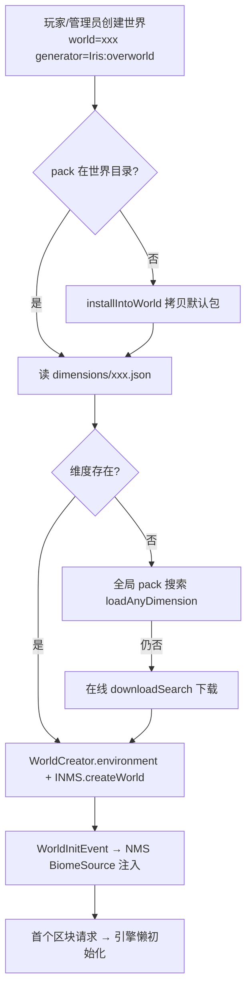

# Iris 工作流分析报告

> 分析时间：2026-08-22 · 覆盖：构建/CI、开发流程、业务工作流（决策树 + 异常恢复）

## 1. 构建与交付管线

### 1.1 现状：无 CI/CD

`.github/` 目录仅含 `ISSUE_TEMPLATE/bug.yml` 与 `feature.yml`，**不存在任何 workflow 文件**；也无 GitLab CI / Jenkinsfile。构建完全依赖本地 `gradlew`。

### 1.2 本地构建管线（build.gradle.kts 解析）

```
gradlew iris（开发者主入口）
  ├── :core:agent jar ──────────────→ Java Agent（Installer 注入器）
  ├── :nms:* reobf（11 模块）────────→ 各版本重映射 NMSBinding
  │     └── NMSTools 插件：buildscript classpath com.github.VolmitSoftware:NMSTools  build.gradle.kts:28
  ├── :core shadow jar ─────────────→ 主 jar（含 Kotlin/Lombok/全部依赖）
  ├── jarJar included(...) ──────────→ 把 11 个 NMS 模块内嵌进一个发布 jar  :120-123
  ├── GenerateApiTask（ApiGenerator.kt）→ 从主 jar 提取公共 API 发布到本地 maven
  └── registerCustomOutputTask(...) → 每位维护者一条私有任务，构建后直拷自己服务器 plugins/  :41-55
```

- **版本矩阵**：`nmsBindings` map 定义 11 个 `v1_21_R7(1.21.11)` ~ `v1_20_R1(1.20.1)`（`build.gradle.kts:71-84`）。
- **一键测试服**：每版本生成 `runServer-<tag>` 任务（runPaper 插件）：10G 堆、`-javaagent` 挂 agent、自动 EULA、watchdog 关闭（`build.gradle.kts:86-117`）——这是项目事实上的"集成测试"。
- **发布渠道**：Spigot 商店（付费）+ BuiltByBit（`Iris.java:414` 水印标记暗示），GitHub 上开源源码。

### 1.3 测试策略：不存在

`find core/src -path "*test*" -name "*.java"` 结果为 0。质量保障 = Sentry 生产上报 + 开发者服务器人工验证 + `runServer-*` 冒烟。

## 2. 开发工作流（从 Git 历史推断）

- **分支模型**：`dev` → PR → `master`（近期合并 `#1241`、`#1236` 等均为 dev→master）。
- **版本节奏**：`v+` 提交标记版本递增（如 `28c494194`），由 Spigot 发布流程驱动。
- **MC 版本适配流**：`7befce108 initial 1.21.11 support` → 连续修复（`fix datapack generation on 1.21.11`、`fix invalid json for ultrawarm dimensions`）——新版本支持是渐进修补式。
- **贡献者私有构建任务**（`build.gradle.kts:41-55`）揭示分布式协作模式：每人本机构建直拷服务器测试。

## 3. 业务工作流映射

Iris 的"业务"是世界创建与生成。五大核心流程：

### 3.1 世界创建流程（用户 → 引擎）



决策链证据：`Iris.java:639-690`、`BukkitChunkGenerator.java:109-139,269-306`。

### 3.2 区块生成决策树（engine.generate 内部）

```
generate(x, z, ...)                                   EngineMode.java:71-78
├── 创建 ChunkContext（预采样 region/biome/height）
├── Stage1: burst[ generateMatter, terrain ]
│   terrain 每列 (terrainSliver):
│   ├── i == 0 && isBedrock? → 强制基岩层              Terrain...java:101-107
│   ├── 矿石命中(biome→region→dimension 三级)? → 矿石  :109-115
│   ├── i > he && i ≤ hf（水下空腔）?
│   │   ├── 海底层列表有该深度? → 沉积层方块           :120-127
│   │   └── 否则 → fluidStream（水）                   :129
│   ├── i ≤ he（地表以下）
│   │   ├── 调色板层有该深度? → 层方块                 :144-147
│   │   ├── 矿石命中? → 矿石                          :149-154
│   │   └── 否则 → rockStream（基岩流）                :156
│   └── hf < 0? → 跳过该列（维度底以下）               :89-91
├── Stage2: burst[ cave.modify, post.modify ]
├── Stage3: burst[ deposit, insertMatter, decorant ]
│   └── insertMatter: isUseMantle()? 否则跳过          EngineMantle.java:178-189
├── Stage4: perfection.modify
└── Stage5: custom.modify（数据包 Kotlin 脚本）
```

### 3.3 Studio（包开发）工作流

| 步骤 | 命令/触发 | 代码 |
|------|----------|------|
| 打开 Studio 世界 | `/iris studio open` → `StudioSVC.open(sender, seed, dim, onDone)` | StudioSVC.java:334-359 |
| 编辑数据包 | VSCode 集成 `openVSCode`（生成 .vscode + schema） | StudioSVC.java:359 |
| 热重载 | 文件保存 → ReactiveFolder → 250ms 轮询 → hotload | BukkitChunkGenerator.java:285-299 |
| 可视化 | VisionGUI（俯视渲染 biome/height 层） / NoiseExplorerGUI | core/gui/ |
| 下载社区包 | `download(sender, repo, branch, trim)` 从 GitHub 拉取 | StudioSVC.java:200-204 |
| 创建包 | `create` / `createFrom`（复制改造） | StudioSVC.java:383-466 |
| 同步工作区 | `updateWorkspace`（IrisProject 重建引用） | StudioSVC.java:474; IrisEngine.java:170 |

### 3.4 预生成工作流（服务器运维）

三种策略（`core/pregenerator/`）：
- **TurboPregenerator**：直接写 region 文件级（不经 Bukkit），最快。
- **DeepSearchPregenerator**：深度搜索待生成区块。
- **LazyPregenerator**：服务器启动时恢复中断任务（`Iris.java:455`）。
- 运行时区块修复：`ChunkUpdater` + `injectChunkReplacement`（`BukkitChunkGenerator.java:200-267`，信号量限流 + 实体清理 + 结构重放）。

### 3.5 存档转换工作流（ConversionSVC + EditSVC）

把原版/其他插件世界转为 Iris 管理或反向导出；`nms` 层提供 MCABiomeContainer/PALETTE 直接操作 Anvil 文件（`INMSBinding.java` 接口）。

## 4. 异常恢复路径汇总

| 流程步骤 | 失败点 | 处理 | 恢复策略 | 证据 |
|---------|--------|------|---------|------|
| 维度加载 | pack 缺失 | 本地→全局→在线下载三级回退 | 自动下载后重试 | Iris.java:675-690 |
| NMS 绑定 | 版本类缺失 | 降级 NMSBinding1X | 功能降级运行 | INMS.java:96-102 |
| 区块生成 | 任意 Throwable | 落盘 + 红色釉陶标记 | 服务器继续运行 | BukkitChunkGenerator.java:373-384 |
| 引擎初始化 | setup 抛错 | Iris.error + 栈 | 引擎标记 failing | IrisEngine.java:196-199 |
| 世界接入 | Engine 为空 | 10 tick 后重试一次 | 二次尝试仍失败则报错 | BukkitChunkGenerator.java:116-121 |
| 配置 | settings.json 手改 | FileWatcher 热重载 | 60s 内生效 | Iris.java:588-595 |
| 主线程任务 | 任务异常 | 捕获 + reportError，不中断队列 | 队列继续 | Iris.java:606-611 |
| 关闭 | JVM 直接退出 | shutdownHook 关引擎/线程池 | 数据落盘 | Iris.java:469-485 |
| 区块更新活化 | 邻区块未加载 | warn + 放弃本次 | 下次加载再试 | Engine.java:278-287 |

**缺乏容错标记**：`getCached` 下载失败仅 reportError 返回 null（调用方需自防 NPE，`Iris.java:189-207`）；`queueRegenerate/dequeueRegenerate` 是 TODO 空实现（`EngineMantle.java:205-211`）。

## 5. 业务规则量化（硬编码常量采样）

| 常量 | 值 | 含义 | 位置 |
|------|-----|------|------|
| `LOAD_LOCKS` | `CPU × 4` | 并发区块重生成上限 | BukkitChunkGenerator.java:73 |
| `LOCK_SIZE` | `Short.MAX_VALUE` | Mantle HyperLock 分段数 | Mantle.java:49 |
| `Semaphore` 活化 | 1024 | updateChunk 并发任务上限 | Engine.java:298 |
| tickQueue 预算 | 25ms | 每 tick 主线程队列时间片 | Iris.java:605 |
| 热重载轮询 | 250ms / 1000ms | Studio Looper / hotloadChecker | BukkitChunkGenerator.java:292,101 |
| 配置热重载 | 60s | checkConfigHotload 周期 | Iris.java:457 |
| 默认种子 | 1337 | 占位种子（后被真实种子覆盖） | Iris.java:652 |
| spawn 高度修正 | 64 | getFixedSpawnLocation 基准 | BukkitChunkGenerator.java:143-153 |
| Mantle keepAlive | 配置 `performance.mantleKeepAlive`（秒） | 板块空闲卸载 | EngineMantle.java:167 |

## 6. 流程改进建议（对接工作流缺口）

1. **补最小 CI**：`gradlew build` + `-PerrorReporting=false` 即可跑通编译检查；NMS 11 模块编译矩阵是天然的回归门禁。
2. **把 `runServer-*` 冒烟脚本化**：runPaper 支持 RCON/控制台断言，可在 CI 里验证插件 enable 无异常。
3. **为 `v+` 版本提交引入 CHANGELOG 自动化**：当前版本历史只能靠 git log 考古。
